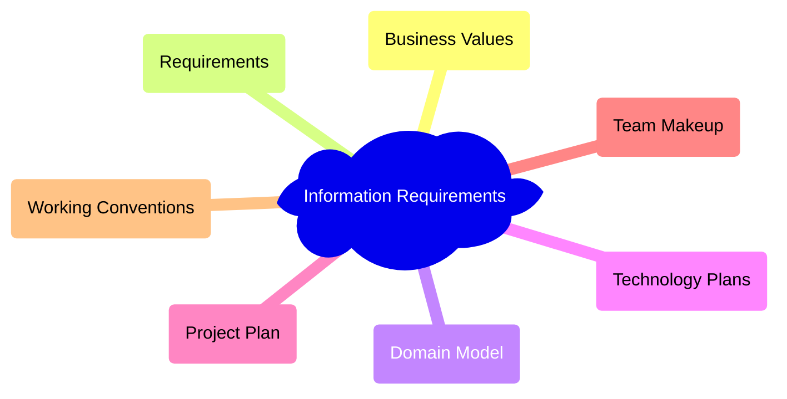

# Possible Strategies for Starting a Project

## Exploratory 360

* Business Vales: - Use Cases, External Services
* Requirements: - System Interfaces
* Domain Model: - Key Concepts
* Technology Plan: - Technology Connectivity, Reliability, Usability
* Project Plan: - Project Map, Stories

[Crystal Clear](https://www.researchgate.net/profile/Alistair-Cockburn/publication/234820806_Crystal_clear_a_human-powered_methodology_for_small_teams/links/56d434b508ae2ea08cf8e07a/Crystal-clear-a-human-powered-methodology-for-small-teams.pdf)

## Methodology Shaping

> "With this little technique, you will build a small library of experiences in your
organization that show the strengths, weaknesses and themes of your organization.
When you go into the methodology shaping workshop, you will examine them and
discuss how to take advantage of the strengths and how to compensate for, or avoid,
the weaknesses."

[Crystal Clear](https://www.researchgate.net/profile/Alistair-Cockburn/publication/234820806_Crystal_clear_a_human-powered_methodology_for_small_teams/links/56d434b508ae2ea08cf8e07a/Crystal-clear-a-human-powered-methodology-for-small-teams.pdf)